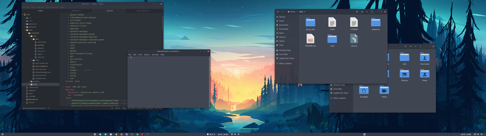

# .dots

New and upgraded dotfiles, now with Ansible!

## What is this?

This is an Ansible project I use to configure and maintain my personal workstations, install software, manage
dotfiles, manage the configuration and more.

## Danger, Will Robinson!

For obvious reasons, you **should not** apply this configuration on your own machine. Doing so **will break your stuff**,
**replace it with my stuff** and possibly, **kill your cat** or any other household pets you might have in the immediate
vicinity. However, you can definitely use this repository to bootstrap your own setup and to try it all out on
a disposable virtual machine.

This Ansible project is only guaranteed to be comptible with Debian Stable.

## Goals and non-goals

The goal is to be able to configure my environment on a fresh machine installs as fast as possible and with as few
manual steps as possible. Having a production grade Ansible project is not a goal of this project, but I will try
my best to keep the manifests somewhat maintainable for the benefit of my own sanity.

## What is automated

- Large portion of the operating system installation (see [autoinstall.conf](./autoinstall.conf)).
- Personal dotfiles, shell, etc.
- Nearly all the software I use on my workstations is setup automatically (sans user configs @ todo).
- Defaults for themes, fonts, dconf settings for GNOME3 and extensions.
- Firewall defaults.
- Some security defaults, SSHD config etc.

## Components

- GNOME desktop.
- [Arc Menu](https://extensions.gnome.org/extension/1228/arc-menu/) extension.
- [Dash to Panel](https://extensions.gnome.org/extension/1160/dash-to-panel/) extension.
- [OpenWeather](https://extensions.gnome.org/extension/750/openweather/) extension.
- [User Themes](https://extensions.gnome.org/extension/19/user-themes/) extension.
- [Arc Dark](https://packages.debian.org/search?suite=default&section=all&arch=any&searchon=names&keywords=arc-theme) GTK theme and shell theme.
- [Papirus Dark](https://packages.debian.org/search?suite=default&section=all&arch=any&searchon=names&keywords=papirus-icon-theme) icons.
- [IBM Plex](https://www.ibm.com/plex/) and [JetBrains Mono](https://www.jetbrains.com/lp/mono/) fonts.
- ... software, tools, things.

### dconf settings and system defaults

Desktop user experience configuration is set as a system wide default profile instead of using per-user settings.
This is done on purpose - not all of my machines are exactly the same and by using system defaults I can still override
some settings locally without having them later reverted by Ansible.

## How to use

1. Set up machine with basic install of Debian with **no desktop environment**. Only base system and 
    "Standard system utilities" are required. SSH server is required if you plan to complete the installation remotely.
3. Move to non-default TTY or SSH into the machine remotely.
2. Install Ansible and other dependencies `sudo apt install python3 python3-pip git`
3. Install Ansible `sudo pip3 install ansible`
4. Clone this repository somewhere. I usually use `~/dots/`.
5. Edit `group_vars/all` as required.
6. As a regular user (probably the same as in `group_vars/all`), execute Ansible as shown bellow:

`ansible-playbook -i hosts site.yml -K -C` to run Ansible in check mode.
`ansible-playbook -i hosts site.yml -K` to run Ansible against localhost.

Setup requires root privileges (but of course it does). Ansible will ask you for your password to become root user. 
This is required because Ansible automates package installation, changes settings only accessible to root etc.

### How to modify and use

1. Fork this repository.
2. Review and modify [workstation main task collection](./roles/workstation/tasks/main.yml).
3. Review and modify [files](./roles/workstation/files) and [templates](roles/workstation/templates).
4. Review and modify [group_vars](./group_vars/all).
5. Commit and push your changes to your fork. 
6. Follow the "How to use" as described above.

**IMPORTANT**: you should NEVER add anything you want to keep secret to a public repository, including passwords,
    private keys and such.

## Things not yet automated

- Gnome shell extensions are not automatically installed, but are required - `Arc menu`, `Dash to panel`, `Openweather`, `User themes`.
- JetBrains Toolbox (no deb available).

## Known issues

- During initial setup, `dconf update` is not executed properly and needs to be run second time manually after all changes are applied.
- During initial setup, localrepo packages are not generated properly.
- Telegram Desktop is old. Very, very old.
- localrepo - it's a dirty hack to obtain some packages automatically. I'd much rather not have this.

## Motivation

Till about June 2020, Elementary was my distribution of choice for all of my personal workstation machines. All of them
were semi-managed using a combination of shell scripts and manual work.

Several changes in Elementary itself, Ubuntu upstream, and some less objective reasons (I was really bored one night)
lead me to the decision that Elementary might no longer fit my personal use case as well as it did when I first
started using it. GNOME has changed a lot since 2012, and so has everything related to it.

I tried several distributions for a couple of days each to determine how they could integrate into my workflows and daily
life, finally settling on Debian with which I have a long prior history - it is my operating system of choice for all my
personal servers, and was my main desktop operating system before mid-2012, before I moved to Elementary. In fact,
the very first Linux operating system I was ever exposed to was Debian, version 2.2 at the time - almost 20 years ago.

While having a spare machine set aside to try an operating system is fairly trivial, moving your entire "baggage" of tools,
configuration and software to similar, albeit somewhat different distribution is not nearly so - especially if you
have multiple machines to maintain - several of which I use daily with several more that I use occasionally, but
still require having the same setup as my daily use machines.

This Ansible project was created to deal with the issue of synchronizing the working environments across all of my physical
machines and keep their configuration more or less the same over extended periods of time.

## Credits

Wallpaper artwork - "Small Memory" © [Mikael Gustafsson](https://mikaelgustafsson.art) - [Dribbble](https://dribbble.com/MikaelGustafsson) - [Twitter](https://twitter.com/mklgustafsson).

## But but but my bootstrap scripts and manual copy pasting of everything?!

Haha Ansible manifests go brrr
